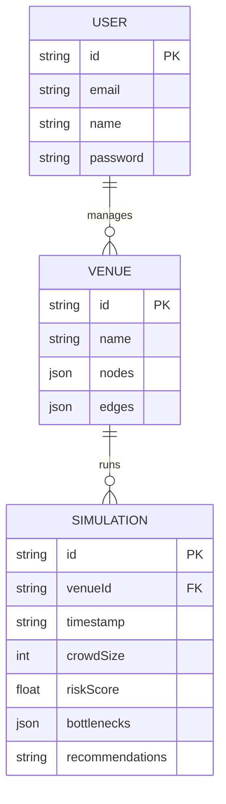

# CrowdFlow AI - Venue Crowd Simulation & Optimization

## 🚀 Overview
CrowdFlow AI is a high-performance, full-stack intelligence platform for simulating large-scale crowd dynamics, detecting bottlenecks, and generating real-time, AI-driven rerouting strategies. Built for modern event organizers and safety officers.

## 📁 Architecture & Tech Stack

- **Frontend**: React 18, Vite, Tailwind CSS, Shadcn UI, Recharts, React Flow (for layout building)
- **Backend**: Node.js, Express, Custom Simulation Engine
- **AI Core**: Hugging Face Inference API (`mistralai/Mistral-7B-Instruct-v0.2`)
- **State Management**: Zustand
- **Authentication**: JWT, bcryptjs

### Folder Structure
```text
/
├── server.ts               # Express Backend Entry & API Definitions
├── package.json            # Scripts & Dependencies
├── vite.config.ts          # Frontend Build Configuration
├── src/
│   ├── components/         # Reusable UI Components
│   │   ├── ui/             # Base level components (buttons, cards, inputs)
│   │   └── Layout.tsx      # Dashboard Shell layout
│   ├── pages/              # Application Views
│   │   ├── Login.tsx       # Auth
│   │   ├── Dashboard.tsx   # Global analytics and density monitoring
│   │   ├── VenueBuilder.tsx# Interactive Graph node editor 
│   │   ├── Simulation.tsx  # Core engine trigger and AI recommendations
│   │   └── Reports.tsx     # Historical run tracking
│   ├── lib/                # Utilities & Store
│   │   ├── store.ts        # Zustand State Manager
│   │   └── utils.ts        # Tailwind merging classes
│   ├── types.ts            # Global Type Definitions
│   ├── App.tsx             # React Router Configuration
│   └── main.tsx            # React Mount Point
```

## 🧠 AI Pipeline (Hugging Face)

The application leverages the `@huggingface/inference` JavaScript SDK to dynamically connect to the Hugging Face Hub. 
- **Selected Model**: `mistralai/Mistral-7B-Instruct-v0.2`
- **Why**: Provides rapid inference capabilities, excels at structural reasoning, and easily processes mathematical context (node density, bottleneck queues) to output safe, human-readable evacuation/rerouting protocols.
- **Workflow**: 
  1. Backend computes mathematical density across the graph network (simulating Mesa/NetworkX).
  2. Critical bottlenecks are identified based on capacity thresholds.
  3. System dynamically constructs an inference prompt containing real-time venue state.
  4. Hugging Face returns ranked, contextual recommendations.

## 📊 Database Schema (ER Diagram)

*(Implemented logically via robust JSON state in this environment)*



## 🔌 API Documentation

| Method | Endpoint | Description | Auth Required |
|--------|----------|-------------|---------------|
| POST   | `/api/auth/register` | Register new user | No |
| POST   | `/api/auth/login` | Authenticate user | No |
| GET    | `/api/venues` | List all venues | Yes |
| POST   | `/api/venues` | Save a new venue | Yes |
| POST   | `/api/simulate` | Trigger graph simulation & HF pipeline | Yes |
| GET    | `/api/simulations` | Retrieve historical logs | Yes |
| GET    | `/api/analytics` | Aggregate density metrics | Yes |

## 🛠 Installation & Deployment Guide

1. **Local Development**
   ```bash
   npm install
   npm run dev
   ```
2. **Production Build**
   ```bash
   npm run build
   ```
3. **Start Production Server**
   ```bash
   npm run start
   ```

**Docker Setup**
Create a `Dockerfile` using the standard `node:20-alpine` base image, copying `package.json`, running `npm install`, then `npm run build`, and finally `CMD ["npm", "run", "start"]`. Expose port `3000`.

## 🎨 Design System
- **Theme**: Dark Apple Glassmorphism.
- **Palette**: Deep charcoal canvases (`hsl(240 10% 3.9%)`), vibrant primary accents (`#3b82f6`), dynamic glow filters matching real-time risk scores (Green = Optimal, Red = Critical).
- **Typography**: Clean, sans-serif metrics focusing on high-contrast numeric display.
